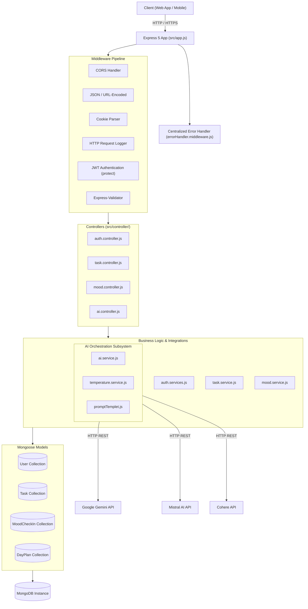
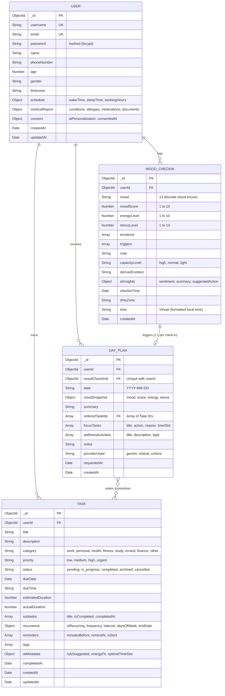
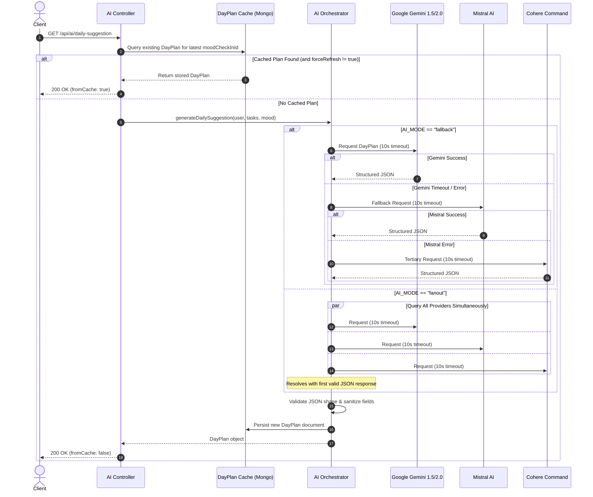
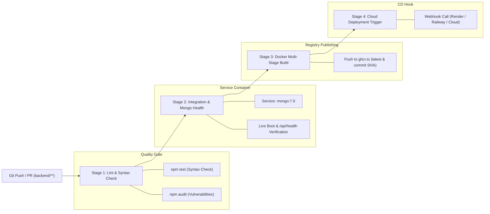

# 🧠 AI Life Manager — Backend API Service

[](https://nodejs.org/)
[](https://expressjs.com/)
[](https://mongoosejs.com/)
[](https://www.docker.com/)
[](https://github.com/features/actions)
[](#license)

The **AI Life Manager Backend** is a wellness-aware productivity and daily orchestration API. Unlike traditional task managers, it synthesizes the user's real-time emotional and physical state (energy level, stress level, mood check-ins), personal health context, and circadian rhythm to dynamically reorder priorities, formulate structured daily action plans, and provide conversational AI wellness coaching.

---

## 📑 Table of Contents

1. [Architectural Overview](#-architectural-overview)
2. [Folder Structure](#-folder-structure)
3. [Full Working Data Models](#-full-working-data-models)
   - [Entity Relationship Diagram](#entity-relationship-diagram)
   - [User Model (`User`)](#1-user-model-user)
   - [Task Model (`Task`)](#2-task-model-task)
   - [Mood Check-In Model (`MoodCheckIn`)](#3-mood-check-in-model-moodcheckin)
   - [Day Plan Model (`DayPlan`)](#4-day-plan-model-dayplan)
4. [AI Orchestration Engine](#-ai-orchestration-engine)
   - [Multi-Provider Resilience (Gemini, Mistral, Cohere)](#multi-provider-resilience)
   - [Fallback vs. Fanout Execution Modes](#fallback-vs-fanout-execution-modes)
   - [Temperature Calibration Matrix](#temperature-calibration-matrix)
   - [Smart Plan Caching](#smart-plan-caching)
5. [API Endpoints Reference](#-api-endpoints-reference)
   - [Authentication & User Profile](#authentication--user-profile)
   - [Task Management](#task-management)
   - [Mood & Emotion Tracking](#mood--emotion-tracking)
   - [AI Planning & Assistant](#ai-planning--assistant)
6. [Security & Middleware Architecture](#-security--middleware-architecture)
7. [Full CI/CD Pipeline & DevOps](#-full-cicd-pipeline--devops)
   - [CI/CD Workflow Lifecycle](#cicd-workflow-lifecycle)
   - [Containerization (Docker)](#containerization-docker)
   - [GitHub Actions Configuration](#github-actions-configuration)
   - [Required Secrets](#required-secrets)
8. [Local Development Setup](#-local-development-setup)
9. [Environment Variables](#-environment-variables)

---

## 🏛 Architectural Overview

The backend is built with **Node.js (ES Modules)**, **Express 5**, and **MongoDB / Mongoose 9**. It follows a decoupled Controller-Service-Repository architecture with centralized error handling and asynchronous request interception.



---

## 📂 Folder Structure

```
backend/
├── .dockerignore                  # Docker build exclusion rules
├── .env.example                   # Template environment variables
├── Dockerfile                     # Multi-stage production container build
├── package.json                   # Dependencies, engines, and run scripts
├── server.js                      # Application entry point, DB bootstrap & graceful shutdown
└── src/
    ├── app.js                     # Express app configuration & middleware pipeline
    ├── config/
    │   └── mongodb.js             # Mongoose connection & connection state listeners
    ├── controller/
    │   ├── ai.controller.js       # Daily suggestion, mood analysis, task ranking & chat
    │   ├── auth.controller.js     # User registration, login, logout, profile
    │   ├── mood.controller.js     # Mood check-in CRUD and aggregate analytics
    │   └── task.controller.js     # Task CRUD, filters, statistics, status transition
    ├── middleware/
    │   ├── auth.middleware.js     # JWT extraction from cookies/headers & user verification
    │   ├── errorHandler.middleware.js # Operational error parser & centralized handler
    │   └── validate.middleware.js # Express-validator schema rules & error formatter
    ├── model/
    │   ├── dayPlan.model.js       # AI daily plan schema & unique compound indexes
    │   ├── moodCheckIns.model.js  # Mood check-in schema, virtuals & scores
    │   ├── task.model.js          # Task, subtasks, recurrence, and AI energy metadata
    │   └── user.model.js          # User identity, circadian schedule & medical profile
    ├── routes/
    │   ├── ai.routes.js           # /api/ai endpoints
    │   ├── auth.routes.js         # /api/auth endpoints
    │   ├── mood.routes.js         # /api/moods endpoints
    │   └── task.routes.js         # /api/tasks endpoints
    ├── services/
    │   ├── auth.services.js       # Token signing & verification helpers
    │   ├── mood.service.js        # Analytics calculation & mood aggregations
    │   ├── task.service.js        # Task filtering, pagination & status logic
    │   └── ai/
    │       ├── ai.service.js      # Multi-provider fallback/fanout engine & JSON parser
    │       ├── promptTemplet.js   # Dynamic prompt builders with medical/mood context
    │       └── temperature.service.js # Dynamic temperature selector by task type
    └── utils/
        ├── asyncHandler.js        # Asynchronous route wrapper
        └── Logger.js              # Winston / structured console logging
```

---

## 🗄 Full Working Data Models

### Entity Relationship Diagram



---

### 1. User Model (`User`)
*File: [`src/model/user.model.js`](file:///e:/AI_Life%20Manager/backend/src/model/user.model.js)*

Stores account identity, demographic parameters, biological circadian rhythm schedule, optional medical profile, and explicit AI data processing consent.

| Field | Type | Required | Constraints / Enums / Defaults | Description |
|---|---|---|---|---|
| `username` | String | Yes | Unique, Indexed, 3–30 chars, `[a-zA-Z0-9_.-]` | Case-insensitive handle |
| `name` | String | Yes | 2–50 chars, trimmed | Display name |
| `email` | String | Yes | Unique, Indexed, Valid Email | Primary communication and login ID |
| `password` | String | Yes | Min 8 chars, `select: false` | Hashed automatically via bcrypt pre-save hook |
| `phoneNumber`| String | No | Valid phone regex | Contact telephone |
| `age` | Number | No | Range 1–120 | Demographic context for AI wellness recommendations |
| `gender` | String | No | `male`, `female`, `other`, `prefer_not_to_say` (Default: `prefer_not_to_say`) | User identity preference |
| `timezone` | String | No | Default: `"UTC"` | Timezone for accurate localized scheduling |
| `schedule.wakeTime` | String | No | Default: `"07:00"` (HH:mm) | Circadian wake target |
| `schedule.sleepTime` | String | No | Default: `"23:00"` (HH:mm) | Circadian sleep target |
| `schedule.workingHours` | Object | No | `{ start: "09:00", end: "18:00" }` | Work window used by AI for task slot placement |
| `medicalReport.conditions` | Array<String> | No | Trimmed strings | Known health conditions (e.g. Migraine, Asthma) |
| `medicalReport.allergies` | Array<String> | No | Trimmed strings | Food or environmental allergies |
| `medicalReport.medications` | Array<String> | No | Trimmed strings | Active prescriptions |
| `medicalReport.documents` | Array<Object> | No | `{ title, fileUrl, uploadedAt }` | Medical lab results or reports |
| `consent.aiPersonalization` | Boolean | No | Default: `false` | Explicit opt-in for AI personalization features |
| `consent.consentedAt` | Date | No | Timestamp | Audit timestamp for consent grant |

**Mongoose Hooks & Methods:**
- `pre("save")`: Automatically detects password modification, creates a 10-round salt, and hashes password.
- `methods.comparePassword(candidatePassword)`: Performs constant-time comparison using `bcrypt.compare`.

---

### 2. Task Model (`Task`)
*File: [`src/model/task.model.js`](file:///e:/AI_Life%20Manager/backend/src/model/task.model.js)*

Comprehensive task entity handling nesting, recurrence engines, notification reminders, and AI-driven energy matching tags.

| Field | Type | Required | Constraints / Enums / Defaults | Description |
|---|---|---|---|---|
| `userId` | ObjectId | Yes | Ref: `User`, Indexed | Owner reference |
| `title` | String | Yes | 1–200 chars, trimmed | Title of task |
| `description` | String | No | Max 2000 chars | Markdown or plain text details |
| `category` | String | No | `work`, `personal`, `health`, `fitness`, `study`, `errand`, `finance`, `other` (Default: `personal`) | Classification tag |
| `priority` | String | No | `low`, `medium`, `high`, `urgent` (Default: `medium`) | Priority status |
| `status` | String | No | `pending`, `in_progress`, `completed`, `archived`, `cancelled` (Default: `pending`) | Lifecycle state |
| `dueDate` | Date | No | Indexed | Calendar target date |
| `dueTime` | String | No | Trimmed (e.g., `"14:30"`) | Optional specific time of day |
| `estimatedDuration` | Number | No | Min: 1 minute | Expected minutes to complete |
| `actualDuration` | Number | No | Default: 0 | Recorded minutes spent |
| `subtasks` | Subdocument Array | No | Sub-schema: `{ title, isCompleted, completedAt }` | Checkable child items |
| `recurrence` | Object | No | `{ isRecurring, frequency: ['daily', 'weekly', 'weekdays', 'monthly', 'custom'], interval, daysOfWeek, endDate }` | Recurring task schedule |
| `reminders` | Array | No | `[{ minutesBefore, remindAt, isSent }]` | Trigger timestamps |
| `tags` | Array<String> | No | Lowercased, trimmed | Categorization labels |
| `aiMetadata.isAiSuggested` | Boolean | No | Default: `false` | Flag if auto-suggested by AI |
| `aiMetadata.energyFit` | String | No | `low_energy`, `medium_energy`, `high_energy` | Required cognitive load level |
| `aiMetadata.optimalTimeSlot` | Object | No | `{ start: String, end: String }` | AI-computed ideal schedule window |
| `completedAt` | Date | No | Set automatically on completion | Timestamp when status transitioned to `completed` |

**Compound Indexes:**
- `{ userId: 1, status: 1, dueDate: 1 }`
- `{ userId: 1, priority: 1 }`
- `{ userId: 1, category: 1 }`

---

### 3. Mood Check-In Model (`MoodCheckIn`)
*File: [`src/model/moodCheckIns.model.js`](file:///e:/AI_Life%20Manager/backend/src/model/moodCheckIns.model.js)*

Captures quantitative and qualitative mental state checkpoints. Powers dynamic DayPlan calculations and long-term wellness trend analytics.

| Field | Type | Required | Constraints / Enums / Defaults | Description |
|---|---|---|---|---|
| `userId` | ObjectId | Yes | Ref: `User`, Indexed | Owner reference |
| `mood` | String | Yes | Enum: `happy`, `excited`, `grateful`, `calm`, `neutral`, `tired`, `anxious`, `stressed`, `sad`, `angry`, `overwhelmed`, `motivated`, `content` | Core emotional identifier |
| `moodScore` | Number | Yes | Min: 1, Max: 10 | Numeric rating of mood |
| `energyLevel` | Number | No | Min: 1, Max: 10, Default: 5 | Physical & cognitive vitality |
| `stressLevel` | Number | No | Min: 1, Max: 10, Default: 5 | Perceived tension or anxiety |
| `emotions` | Array<String> | No | Lowercase, trimmed strings | Specific feeling descriptors |
| `triggers` | Array<String> | No | Lowercase, trimmed strings | Antecedents (e.g., "poor sleep", "deadline") |
| `note` | String | No | Max 1000 chars | Journaling entry |
| `capacityLevel` | String | No | `high`, `normal`, `light` (Default: `normal`) | Evaluated work throughput band |
| `derivedContext` | String | No | Max 200 chars | AI-extracted situational context |
| `aiInsights.sentiment`| String | No | `positive`, `neutral`, `negative` | NLP sentiment polarity |
| `aiInsights.summary` | String | No | NLP synthesis | Brief analytical summary |
| `aiInsights.suggestedAction` | String | No | Practical recommendation | Fast intervention tip |
| `checkInTime` | Date | No | Default: `Date.now`, Indexed | Exact recorded timestamp |
| `timeZone` | String | No | Default: `"UTC"` | Timezone context for formatting |
| `time` *(Virtual)* | String | Virtual | Computed via `Intl.DateTimeFormat` | Formatted 12-hour clock (e.g. `"2:45 PM"`) |

**Compound Indexes:**
- `{ userId: 1, checkInTime: -1 }` (Enables instant lookup of latest user mood)

---

### 4. Day Plan Model (`DayPlan`)
*File: [`src/model/dayPlan.model.js`](file:///e:/AI_Life%20Manager/backend/src/model/dayPlan.model.js)*

The core artifact generated by the AI engine. Represents the actionable synthesis of tasks, schedule constraints, and the user's emotional readiness.

| Field | Type | Required | Description |
|---|---|---|---|
| `userId` | ObjectId | Yes | Ref: `User`, Indexed |
| `moodCheckInId` | ObjectId | Yes | Ref: `MoodCheckIn`, Indexed |
| `date` | String | Yes | Standardized date string (`"YYYY-MM-DD"`) |
| `moodSnapshot` | Object | No | Snapshot of `{ mood, moodScore, energyLevel, stressLevel, checkInTime, time }` |
| `summary` | String | Yes | High-level tactical coaching summary for the day |
| `orderedTaskIds` | Array<ObjectId> | No | Array of `Task` IDs sequenced by cognitive feasibility |
| `focusTasks` | Array<Object> | No | Items: `{ title, action, reason, timeSlot }` |
| `wellnessActivities` | Array<Object> | No | Items: `{ title, description, type: ['rest', 'move', 'hydrate', 'eat', 'other'] }` |
| `notes` | String | No | Personal motivation or cautionary guidance |
| `providerUsed` | String | No | LLM backend that satisfied the plan request (`gemini`, `mistral`, `cohere`) |
| `requestedAt` | Date | No | Default: `Date.now` |

**Compound Indexes:**
- `{ userId: 1, moodCheckInId: 1 }` (Unique compound index — prevents duplicate AI runs for the same mood check-in)
- `{ userId: 1, date: 1 }`

---

## 🤖 AI Orchestration Engine

The backend features an enterprise-grade multi-LLM orchestration layer in [`src/services/ai/ai.service.js`](file:///e:/AI_Life%20Manager/backend/src/services/ai/ai.service.js).



### Multi-Provider Resilience
- **Google Gemini**: Primary high-capacity multimodal model.
- **Mistral AI**: Fast, instruction-following fallback (`mistral-small-latest`).
- **Cohere**: High-accuracy natural language generation fallback (`command-r`).
- **Timeout Protection**: Each outbound provider call is capped at **10,000ms** using `AbortController` to prevent upstream AI latency from cascading.

### Fallback vs. Fanout Execution Modes
Set via the `AI_MODE` environment variable:
- `fallback` *(Default)*: Tries providers sequentially according to `AI_PROVIDER_ORDER=gemini,mistral,cohere`. Minimizes API token consumption.
- `fanout`: Dispatches requests to all available providers in parallel using `Promise.any`. Returns the quickest valid structured response. Optimizes for minimal end-user response time.

### Temperature Calibration Matrix
Managed dynamically by [`src/services/ai/temperature.service.js`](file:///e:/AI_Life%20Manager/backend/src/services/ai/temperature.service.js):

| AI Feature | Temperature | Determinism | Rationale |
|---|---|---|---|
| **Daily Suggestion (`DayPlan`)** | `0.4` | High | Strict adherence to JSON schema, schedule limits, and logical task sequencing. |
| **Task Prioritization** | `0.3` | Very High | Mathematical consistency in ranking urgency, importance, and mental bandwidth. |
| **Mood Analysis** | `0.6` | Balanced | Empathetic yet grounded psychological insight formulation. |
| **Quick Chat / Coaching** | `0.7` | Creative | Engaging, conversational, supportive life-coaching persona. |

---

## 🔌 API Endpoints Reference

### Base URL
`http://localhost:3000` (or your configured production domain)

### Health Checks
- `GET /` — Root status message and system timestamp.
- `GET /api/health` — System uptime and container health check probe.

---

### Authentication & User Profile
Base Route: `/api/auth`

| Method | Endpoint | Access | Description |
|---|---|---|---|
| `POST` | `/register` | Public | Register new user. Sets JWT in httpOnly cookie & returns user object. |
| `POST` | `/login` | Public | Authenticate with email/username + password. Sets JWT cookie. |
| `POST` | `/logout` | Public | Clears authentication cookie. |
| `GET` | `/me` | Private | Retrieve current authenticated user profile & schedule. |
| `PUT` | `/profile` | Private | Update name, schedule, medical report, and AI consent. |

#### Sample Registration Payload:
```json
{
  "username": "alex_runner",
  "name": "Alex Mercer",
  "email": "alex@example.com",
  "password": "SecurePassword123!",
  "timezone": "America/New_York",
  "schedule": {
    "wakeTime": "06:30",
    "sleepTime": "22:30",
    "workingHours": { "start": "09:00", "end": "17:00" }
  },
  "consent": { "aiPersonalization": true }
}
```

---

### Task Management
Base Route: `/api/tasks` *(All routes require Authentication)*

| Method | Endpoint | Query Filters | Description |
|---|---|---|---|
| `GET` | `/` | `status`, `priority`, `category`, `search`, `page`, `limit` | Paginated task list with filtering. |
| `POST` | `/` | — | Create new task with subtasks and recurrence. |
| `GET` | `/stats` | — | Aggregate metrics (completed, pending, overdue counts). |
| `GET` | `/:id` | — | Fetch single task by ObjectId. |
| `PUT` | `/:id` | — | Update all mutable task properties. |
| `PATCH` | `/:id/status` | — | Fast status toggle (`completed`, `pending`, etc.). |
| `DELETE`| `/:id` | — | Delete a task. |

---

### Mood & Emotion Tracking
Base Route: `/api/moods` *(All routes require Authentication)*

| Method | Endpoint | Description |
|---|---|---|
| `POST` | `/` | Log new mood check-in (mood, scores, emotions, triggers, note). |
| `GET` | `/` | List mood history with pagination. |
| `GET` | `/latest` | Get the most recent mood check-in record. |
| `GET` | `/analytics`| Trend analytics (averages for mood, energy, and stress over time). |
| `GET` | `/:id` | Retrieve check-in details by ID. |
| `PUT` | `/:id` | Update mood check-in note or tags. |
| `DELETE`| `/:id` | Delete mood check-in record. |

---

### AI Planning & Assistant
Base Route: `/api/ai` *(All routes require Authentication)*

| Method | Endpoint | Parameters / Body | Description |
|---|---|---|---|
| `GET` | `/daily-suggestion` | `?forceRefresh=true` | Returns personalized `DayPlan` synthesized from current mood + pending tasks. |
| `GET` | `/prioritize-tasks` | — | AI-ranked task sequence matched to current energy capacity. |
| `GET` | `/mood-analysis` | `?days=30` | Longitudinal emotional sentiment and burnout-risk assessment. |
| `POST` | `/chat` | `{ "message": "string" }` | Conversational assistant aware of your pending tasks and current mental state. |

---

## 🔒 Security & Middleware Architecture

1. **Authentication Token Lifecycle**:
   - JWT tokens signed with SHA-256 HMAC (`jsonwebtoken`).
   - Delivered via **`httpOnly`**, **`SameSite`**, and **`secure`** (in production) cookies, mitigating XSS token theft.
   - Fallback support for `Authorization: Bearer <token>` headers for mobile or cross-origin consumers.
2. **Password Cryptography**:
   - Salted with 10 rounds of bcrypt prior to persistence.
   - Password fields excluded from default queries via Mongoose `select: false`.
3. **Input Sanitization & Validation**:
   - Comprehensive request schemas validated via `express-validator`.
   - Reject malformed payloads before reaching controllers.
4. **Resilient Error Management**:
   - Standardized `AppError` class with operational flags and HTTP status codes.
   - Global error handler intercepts duplicate key errors (code `11000`), CastErrors, and JWT verification failures without leaking stack traces in production.

---

## 🚀 Full CI/CD Pipeline & DevOps

### CI/CD Workflow Lifecycle

The repository includes an automated GitHub Actions pipeline in [`.github/workflows/backend-ci-cd.yml`](file:///e:/AI_Life%20Manager/.github/workflows/backend-ci-cd.yml):



### Stage Summary:
1. **Lint & Syntax Check (`lint-and-validate`)**:
   - Runs on `ubuntu-latest` with Node.js 20.x.
   - Performs clean package install with `npm ci`.
   - Executes `npm test` syntax tree validation.
   - Performs high-severity vulnerability audit with `npm audit`.
2. **Integration Check (`integration-check`)**:
   - Boots a live MongoDB 7.0 container in GitHub Actions service runners.
   - Launches `server.js` with isolated test environment credentials.
   - Probes `http://localhost:3000/api/health` with `curl` to ensure full operational readiness.
3. **Container Build & Publish (`docker-build`)**:
   - Executes automatically on `push` to `main` or `master`.
   - Sets up QEMU and Docker Buildx.
   - Builds the production multi-stage Docker image with layer caching (`type=gha`).
   - Publishes tagged images to **GitHub Container Registry (GHCR)**:
     - `ghcr.io/<owner>/<repo>/backend:latest`
     - `ghcr.io/<owner>/<repo>/backend:<short-sha>`
4. **Continuous Deployment (`deploy`)**:
   - Dispatches an automated POST trigger to your cloud deployment webhook (Render, Railway, AWS App Runner, or Kubernetes webhook).

---

### Containerization (Docker)

The project features an optimized, hardened production [Dockerfile](file:///e:/AI_Life%20Manager/backend/Dockerfile):
- **Multi-Stage Build**: Separates dependency installation from the final image, drastically reducing container size.
- **Rootless Security**: Runs with unprivileged user `node:node` rather than root.
- **Built-in Healthcheck**: Includes an integrated HTTP health probe:
  ```dockerfile
  HEALTHCHECK --interval=30s --timeout=5s --start-period=10s --retries=3 \
    CMD wget --no-verbose --tries=1 --spider http://localhost:3000/api/health || exit 1
  ```

#### Build and Run Locally with Docker:
```bash
# Build Docker image
docker build -t ai-life-manager-backend ./backend

# Run container
docker run -d \
  --name ai-backend \
  -p 3000:3000 \
  --env-file ./backend/.env \
  ai-life-manager-backend
```

---

### Required Secrets

To configure the CI/CD pipeline on GitHub, navigate to **Settings > Secrets and variables > Actions** and add:

| Secret Name | Description | Required For |
|---|---|---|
| `GITHUB_TOKEN` | Automatically provided by GitHub Actions for GHCR image pushing | Docker Publishing |
| `DEPLOY_WEBHOOK_URL` | Cloud provider deploy hook URL (Render, Railway, etc.) | Automated Continuous Deployment |

---

## 💻 Local Development Setup

### Prerequisites
- [Node.js](https://nodejs.org/) v18.x or v20.x
- [MongoDB](https://www.mongodb.com/) running locally or a [MongoDB Atlas](https://www.mongodb.com/cloud/atlas) cluster URI
- At least one LLM API key (Google Gemini, Mistral AI, or Cohere)

### Installation Steps

1. **Navigate to the backend directory**:
   ```bash
   cd "e:/AI_Life Manager/backend"
   ```

2. **Install dependencies**:
   ```bash
   npm install
   ```

3. **Configure Environment Variables**:
   Create a `.env` file in the `backend/` directory:
   ```env
   PORT=3000
   NODE_ENV=development
   MONGODB_URI=mongodb://localhost:27017/ai_life_manager
   JWT_SECRET=your_super_secret_jwt_key_at_least_32_characters_long
   JWT_EXPIRES_IN=30d
   CLIENT_URL=http://localhost:5173

   # AI LLM Provider Keys
   GOOGLE_API_KEY=your_gemini_api_key_here
   MISTRALAI_API_KEY=your_mistral_api_key_here
   COHERE_API_KEY=your_cohere_api_key_here

   # AI Execution Configuration (optional)
   AI_MODE=fallback
   AI_PROVIDER_ORDER=gemini,mistral,cohere
   ```

4. **Run the Development Server**:
   ```bash
   npm run dev
   ```
   The server will start with hot-reloading on `http://localhost:3000`.

5. **Run Syntax & Integrity Verification**:
   ```bash
   npm test
   ```

---

## ⚙ Environment Variables

| Variable | Type | Default | Description |
|---|---|---|---|
| `PORT` | Number | `3000` | Port on which Express listens |
| `NODE_ENV` | String | `development` | Runtime environment (`development`, `production`, `test`) |
| `MONGODB_URI` | String | *Required* | MongoDB connection string |
| `JWT_SECRET` | String | *Required* | High-entropy secret key for token signing |
| `JWT_EXPIRES_IN` | String | `30d` | JWT lifespan (`1d`, `7d`, `30d`) |
| `CLIENT_URL` | String | `http://localhost:5173` | Allowed CORS origin for frontend application |
| `GOOGLE_API_KEY` | String | Optional* | API Key for Google Gemini 1.5/2.0 Flash |
| `MISTRALAI_API_KEY`| String | Optional* | API Key for Mistral AI |
| `COHERE_API_KEY` | String | Optional* | API Key for Cohere Command-R |
| `AI_MODE` | String | `fallback` | LLM invocation strategy: `fallback` or `fanout` |
| `AI_PROVIDER_ORDER`| String | `gemini,mistral,cohere` | Comma-separated preference order for fallback mode |

*\*At least one AI API key is required to utilize personalized Day Planning, Task Prioritization, and Chat capabilities.*

---

## 📄 License
This project is licensed under the **ISC License**.
